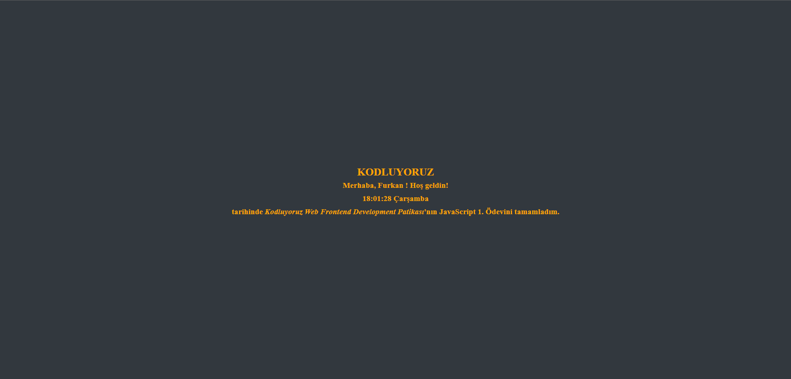

# Patika JS Task 1 [tr]

 > Bu proje Patika JS Modülünün ilk ödevi.

## Projeyi kullanabilmeniz için gerekenler

- [Visual Studio Code](https://code.visualstudio.com/download)
- [Git](https://git-scm.com/downloads)

## Kurulum

1. Bir dosya oluşturulur.
2. Üzerine sağ tıklanıp terminal açılır.
3. Aşağıdaki metin terminale yazılarak proje kopyalanır.
`git https://github.com/furkanpamuk/Patika_JS_Task1.git` 
4. Aşağıdaki metin terminale yazılarak Visual Studio Code ile proje açılır.  
`code .`
    
 

# Patika JS Task 1 [en]
> This project is the first assignment of the Patika JS Module.

## Requirements to use the project

- [Visual Studio Code](https://code.visualstudio.com/download)
- [Git](https://git-scm.com/downloads)

## Setup

1. A file is created.
2. Right click on it and the terminal opens.
3. The project is copied by typing the following text into the terminal.
    `git https://github.com/furkanpamuk/Patika_JS_Task1.git`
4. The project is opened with Visual Studio Code by typing the following text into the terminal.
    `code .`

## Projeden fotoğraflar / Photos from the project

